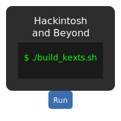

# Hackintosh and Beyond Script

This repository contains a collection of automation scripts that download and
build a wide range of kext projects used in the Hackintosh community.

The main script clones the open-source repositories, builds them with Xcode and
collects the resulting kexts in a single output directory.



## Usage

The main executable script is `Hackintosh-and-beyond_script`. Run it from a
macOS environment with Xcode installed:

```bash
chmod +x Hackintosh-and-beyond_script
./Hackintosh-and-beyond_script
```

The script will clone the necessary repositories into `~/Desktop/KextsCodiFonteRelease`,
build them and copy the built kexts to `~/Desktop/Release/package/Kexts`.

## Contents

- `Hackintosh And Beyond Script.app` &mdash; a packaged macOS application
  containing the same script for convenience.
- `Hackintosh-and-beyond_script` &mdash; the bash script that performs all
  cloning and build steps.
- `images/` &mdash; artwork used in this repository.

Feel free to customize and adapt the script for your own build workflow!
